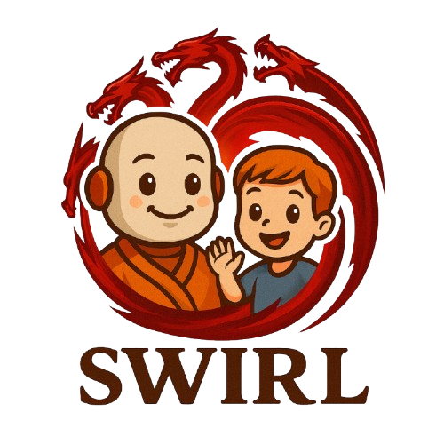

<div align="center">
  
</div>


<div align="center">

# [SWIRL: A Staged Workflow for Interleaved Reinforcement Learning in Mobile GUI Control](assets/SWIRL.pdf)  
 Quanfeng Lu⭐️, Zhantao Ma⭐️, Shuai Zhong, Jin Wang, Dahai Yu, Michael K. Ng, Ping Luo✉️   
 ⭐️ Equal Contribution  ✉️ Corresponding Author


</div>


<div align="center">
<p align="center">
  📖<a href="https://github.com/Lqf-HFNJU/SWIRL/blob/main/assets/SWIRL.pdf">Paper</a> |
  🤗<a href="https://huggingface.co/collections/hflqf88888/swirl-68af365e66fc554a8ff310b6">SWIRL</a> |
   📊<a href="https://huggingface.co/datasets/hflqf88888/SWIRL_GUI_data">Dataset</a>
</p>
</div>


---


## 🎯 Introduction

We introduce **SWIRL**, a staged workflow for interleaved reinforcement learning designed for multi-agent systems. SWIRL reformulates multi-agent reinforcement learning (MARL) into a sequence of single-agent reinforcement learning tasks, updating one agent at a time while keeping the others fixed. This formulation enables stable training and promotes efficient coordination across agents. Theoretically, we provide stepwise safety bounds, a cross-round monotonic improvement theorem, and convergence guarantees on return, ensuring robust and principled optimization. In application to mobile GUI control, SWIRL instantiates a **Navigator** that converts language and screen context into structured plans, and an **Interactor** that grounds these plans into executable atomic actions. With this decoupled design and the stability of interleaved updates, our system attains state-of-the-art zero-shot performance on both high-level and low-level mobile GUI benchmarks using only $3{,}500$ training examples, outperforming baselines trained under diverse SFT and RL regimes. Beyond GUI tasks, SWIRL also demonstrates strong capability in multi-agent mathematical reasoning, underscoring its potential as a general framework for developing efficient and robust multi-agent systems.


<div align="center">
  
</div>

#### Core Contributions

1. We introduce SWIRL, a multi-agent training framework that interleaves single-agent updates and transforms MARL to a sequence of single-agent RL problems; it achieves \(O(1)\) actor memory usage by loading only the currently updated agent, and accommodates heterogeneous model sizes, data schedules, and update budgets.
2. We establish formal guarantees, including a per step safety bound, a monotonic improvement result across rounds, and convergence of returns.
3. We instantiate SWIRL for mobile GUI control with a Navigator and an Interactor and, through extensive experiments, show stable training and state of the art zero-shot performance, together with ablations that clarify when interleaving helps.
4. We demonstrate transferability by applying the same training recipe to a non-GUI domain (e.g., mathematics) and observe consistent gains on standard benchmarks, indicating potential for broader multi-agent applications.


#### Open-Source Release
We open-source our complete pipeline to support further research in this area.
All codes, models, and datasets are publicly available:

<div align="center">

| Domain | Model | Dataset |
| :-- | :-: | :--: |
| GUI Control  | [SWIRL-GUI](https://huggingface.co/hflqf88888/SWIRL_GUI)  | [SWIRL-GUI-data](https://huggingface.co/datasets/hflqf88888/SWIRL_GUI_data)  |
| Math Reasoning  | [SWIRL-MATH](https://huggingface.co/hflqf88888/SWIRL_MATH)  | [SWIRL-MATH-data](https://huggingface.co/datasets/hflqf88888/SWIRL_MATH_data)  |

</div>

## 🏁 Getting Started

### 📦 Installation

We recommend following the [official VeRL installation guide](https://verl.readthedocs.io/en/latest/start/install.html).
Below are the key package versions used in our setup:

```text
python == 3.10
CUDA == 12.4

accelerate == 1.7.0
deepspeed == 0.16.4
flash_attn == 2.7.4.post1
flashinfer-python == 0.2.5
ray == 2.46.0
sgl-kernel == 0.1.4
sglang == 0.4.6.post5
torch == 2.6.0
transformers == 4.51.1
vllm == 0.8.5.post1
xformers == 0.0.29.post2
xgrammar == 0.1.19
```


### 🚀 Quick Start

```shell
python demo/demo.py
```


## ⚙️ Detailed Documentation
Please refer to [this](examples/README.md).


## 🎓 Acknowledgements
We gratefully acknowledge the open-source projects that made this work possible: [VeRL](https://github.com/volcengine/verl), [Qwen2.5-VL](https://github.com/QwenLM/Qwen2.5-VL), [vLLM](https://github.com/vllm-project/vllm), and [SGLang](https://github.com/sgl-project/sglang).

## 🖊️ Citation 
If you feel SWIRL useful in your project or research, please kindly use the following BibTeX entry to cite our paper. Thanks!

```

```
